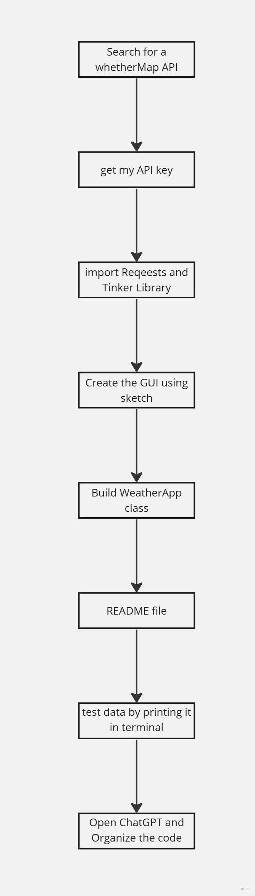

# WeatherApp

## Description
This is a simple weather forecasting application that fetches real-time weather data using Tomorrow.io API based on the user's entered location.




## Prerequisites
- Python 3.7 or higher
- Tkinter GUI framework
- `requests` library
- Tomorrow.io API key

## Setup and Usage

1. Clone the repository:
   ```bash
   git clone https://github.com/MMansy19/WeatherApp.git
   
   
2. Install required dependencies:

    pip install requests


3. Open WeatherApp.py in a text editor and replace "HD01H1K4Agc76RPKAs6gRUvKZqaZ0kll" with your Tomorrow.io API key.


## Features
- Retrieves weather data including temperature, humidity, wind speed, pressure, and precipitation.
- Clean and intuitive GUI design.
- Error handling for user input and API requests.

## Usage
1. Run the application: `python weather_app.py`
2. Enter the desired location in the provided input field.
3. Click the "Search" button to retrieve the weather forecast for the specified location.
4. The app will display the temperature, humidity, wind speed, pressure, and precipitation information.


4. Run the application:

    python WeatherApp.py


5. Enter a location in the provided entry field and click the "Search" button to get weather information.


## Contributing
Contributions are welcome! If you find any issues or have suggestions for improvements, please open an issue or submit a pull request.

## License
This project is licensed under the [MIT License](LICENSE).

